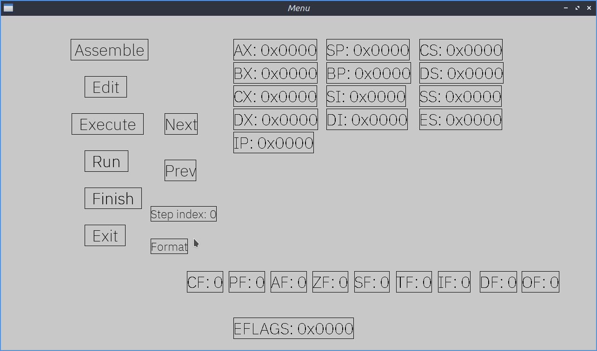
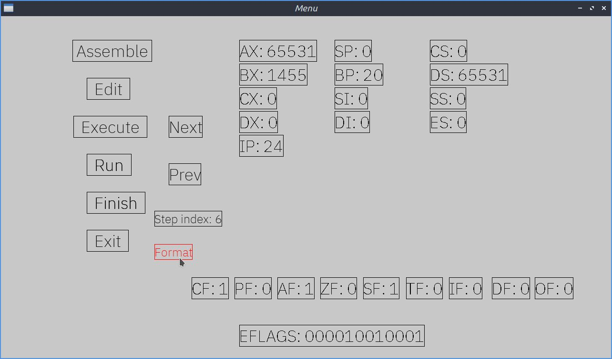
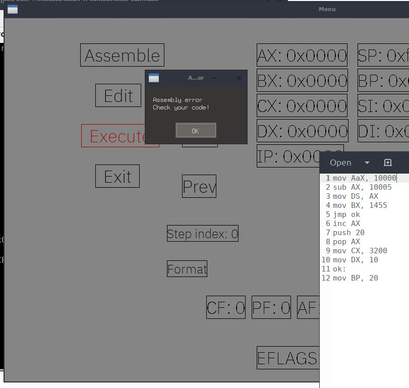

# tiny-emu (8086 emulator)
Minimalistic Intel 8086 (16-bit microprocessor) emulator
  
## Description
### Features

- Register visualization:

    - Data registers: AX, BX, CX, DX
    - Index registers: SI, DI
    - Pointer registers: SP, BP
    - Segment registers: CS, DS, SS, ES
    - Flags register (EFLAGS): CF, PF, AF, ZF, SF, TF, IF, DF, OF
- Step by step instructions execution (Next/Previous)
- Format switching (hexadecimal/decimal)
- Assembling error notification
- Automatic assembling & execution (run + finish)
- Separate assembling/execution
  
- Before:

- After (execution and changing the format):

- Assembly error:

---
## Installation

The 8086-emulator requires the following:

- [**Unicorn**](https://www.unicorn-engine.org/) - powerful CPU emulator; (follow the instructions on their docs/github page)
- [**Keystone**](https://www.keystone-engine.org/) - lightweight multi-platform, multi-architecture assembler framework; (follow the instructions on their docs/github page)
- [**SDL**](https://www.libsdl.org/) - cross-platform development library (apt-get install libsdl2-dev libsdl2-image-dev libsdl2-ttf-dev libsdl2-mixer-dev);

Compile the project with the following script: 
- **./run.sh** 
---
## How to use it
 

- Launch the emulator: ./mini_emu

- Use the <u>**Edit**</u> button to write assembly code

- The code can be edited in "asm_code.asm" (one instruction per line)
      eg:  ...  mov AX, 100   
        add AX, BX   ...

- Use the <u>**Assemble**</u> button to turn assembly code into machine code

- Use the <u>**Execute**</u> button to execute machine code instructions

- Use the <u>**Run**</u> button to assemble and execute your input (.asm)

- Change the format (hex/decimal), by clicking the <u>**Format**</u> button

- Use <u>**Next**</u> and <u>**Prev**</u> to watch the execution unfold step by step

- <u>**Step index**</u> indicates the current instruction

- <u>**Finish**</u> executes all the steps

---
 

## Changelog
- ### [See changes](CHANGELOG.md)

---

## "Milestones"

See [Changelog](CHANGELOG.md), but to sum it up:

- Connecting Keystone and Unicorn
- Merging everything into one single program (unicorn's machine code input file is meant to be stored and read as *binary* data, not string or anything else). Up until that point, the unicorn powered CPU needed its own header (generated with each execution)
- Rendering, done from scratch (loading textures and surfaces, font blending and display logic - hover effects) as well as events handling via SDL.

The code could use some refactoring (especially the main loop).
